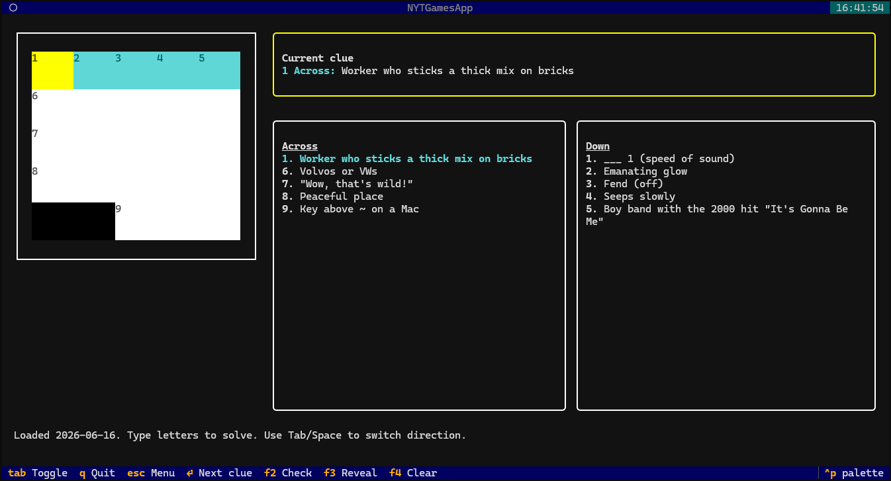

# NYT Games TUI

A Textual terminal app for playing downloaded NYT-style puzzle data. The app
currently supports Mini, Midi, and Daily Crossword puzzles. 
Connections is present in the top-level menu, but its game
screen is not implemented yet.



Puzzle JSON files are stored under `puzzle_data/`, split by puzzle type:

```text
puzzle_data/
  mini/YYYY-MM-DD.json
  midi/YYYY-MM-DD.json
  crossword/YYYY-MM-DD.json
  connections/YYYY-MM-DD.json
```

## Requirements

- Python 3.13
- [uv](https://docs.astral.sh/uv/) for dependency and environment management

Install dependencies from the lockfile:

```bash
uv sync
```

## Download Puzzles

Use `download.py` to fetch puzzle JSON files into `puzzle_data/`.

Download every supported puzzle type from its first available date through
today:

```bash
uv run download.py
```

Download one puzzle type from its first available date through today:

```bash
uv run download.py mini
uv run download.py midi
uv run download.py crossword
uv run download.py connections
```

Download one puzzle type from a specific date through today:

```bash
uv run download.py crossword 2026-06-01
```

Available start dates:

```text
crossword   1993-11-21
mini        2014-08-21
connections 2023-06-12
midi        2026-02-25
```

The downloader validates puzzle type, date format, future dates, and dates
before a puzzle type's first available puzzle.

## Run The App

Launch the top-level game menu:

```bash
uv run main.py
```

Select `Mini`, `Midi`, or `Crossword`, then choose a puzzle date from the list.

You can also launch the crossword player directly for a specific crossword
type:

```bash
uv run crossword.py mini
uv run crossword.py midi
uv run crossword.py crossword
```

Or open one puzzle JSON file directly:

```bash
uv run crossword.py mini puzzle_data/mini/2026-06-16.json
```

## Crossword Controls

```text
Arrow keys       Move in the current direction
Perpendicular arrow
                 Switch between Across and Down
A-Z              Type a letter
Backspace/Delete Erase
Tab or Space     Toggle Across/Down
Enter            Jump to next clue
F2               Check filled answers
F3               Reveal puzzle
F4               Clear puzzle
Esc              Return to the puzzle menu
Q                Quit
```
